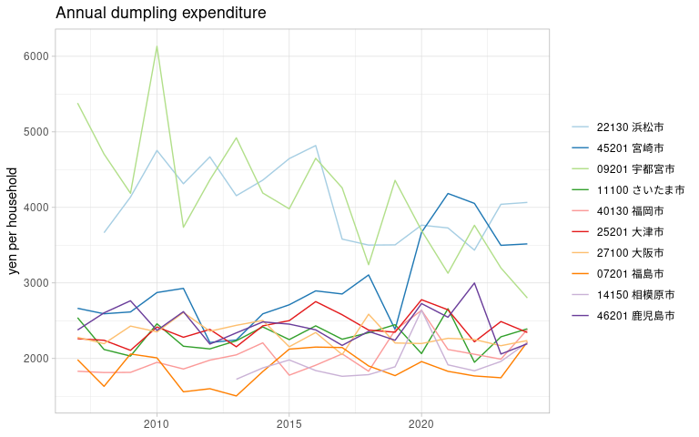
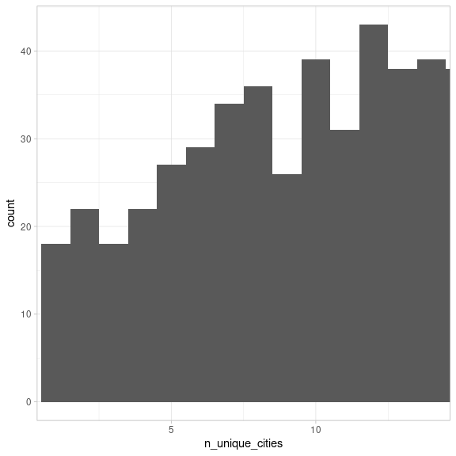

Japan Family Income and Expenditure Survey, city competition
================
Mitsuo Shiota
2019-04-19

- [Summary](#summary)
- [Get meta data](#get-meta-data)
- [Get data](#get-data)
- [Confirm the Hamamatsu-city’s come-back win in
  dumplings](#confirm-the-hamamatsu-citys-come-back-win-in-dumplings)
- [Hamamatsu-city also regained championship in grilled
  eel](#hamamatsu-city-also-regained-championship-in-grilled-eel)
- [Persistent victory items are mostly speciality
  goods](#persistent-victory-items-are-mostly-speciality-goods)
- [Who are the top rank earners in
  2023?](#who-are-the-top-rank-earners-in-2023)
- [Ranks distribution in each city in
  2023](#ranks-distribution-in-each-city-in-2023)

<!-- badges: start -->

[](https://github.com/mitsuoxv/jp-household/actions/workflows/R-CMD-check.yaml)
<!-- badges: end -->

Updated: 2024-02-06

I have made [shinyapps.io](https://mitsuoxv.shinyapps.io/jp-household/),
based on these data.

Warning: If you can’t read Japanese, it would be very difficult for you
to follow me in this project of exploring [e-Stat, Statistics of
Japan](https://www.e-stat.go.jp/en). I tried to refer to English pages,
but often failed to find them. Even in API, when I set the parameter
lang as “E” for English, the response was “statsDataId equal to
\[0003125169\] does not exist”. I had to set lang as “J” for Japanese,
instead.

## Summary

I hear which city in Japan consumed most dumplings (gyouza in Japanese,
and jiaozi in Chinese) per household last year. This is an annual
routine news report. In 2023, Hamamatsu-city came back to the top rank
[(Japanese)](https://www.at-s.com/news/article/shizuoka/1408002.html),
based on [Family Income and Expenditure
Survey](https://www.stat.go.jp/english/data/kakei/) by the Statistics
Bureau, Ministry of Internal Affairs and Communications. So I get data
from [e-Stat](https://www.e-stat.go.jp/en) by using [estatapi package by
yutannihilation](https://github.com/yutannihilation/estatapi/blob/master/README.en.md).

I find that persistent winning items are speciality goods of each city.
I list the top earners in 2023. I draw ranks distribution in each city
in 2023. And I argue ranks distribution is partly due to total
expenditure differences.

## Get meta data

I had to register and get appID, following the instructions in [this
page (Japanese)](https://www.e-stat.go.jp/api/api-info/api-guide). I
saved appID as ESTAT_API_KEY in .Renviron file.

``` r
estat_api_key <- Sys.getenv("ESTAT_API_KEY")
```

I search around in Family Income and Expenditure Survey, and manage to
know the statsDataId of the appropriate table is “0003348239” from [this
page
(Japanese)](https://www.e-stat.go.jp/stat-search/database?page=1&layout=datalist&toukei=00200561&tstat=000000330001&cycle=7&tclass1=000000330001&tclass2=000000330004&statdisp_id=0003348239&result_page=1&tclass3val=0).
As I mentioned in the warning in the top, I failed to set lang = “E”, so
I set “J” instead.

Look at the structure of the response. It is a list of 6 data frames.
estat_getStatsData function, which I will use later, utilizes @code and
@name in each data frame, and add @name. In this case, I would like to
keep @level in cat01. I make lookup table for cat01, and drop “@” in the
column names. I can check which level I should use, and search
“ぎょうざ”.

``` r
meta_info <- estatapi::estat_getMetaInfo(appId = estat_api_key,
                               lang = "J",
                               statsDataId = "0003348239")

str(meta_info)
```

    ## List of 6
    ##  $ tab   : tibble [1 × 3] (S3: tbl_df/tbl/data.frame)
    ##   ..$ @code : chr "01"
    ##   ..$ @name : chr "金額"
    ##   ..$ @level: chr ""
    ##  $ cat01 : tibble [690 × 5] (S3: tbl_df/tbl/data.frame)
    ##   ..$ @code      : chr [1:690] "000100000" "000200000" "000300000" "000400000" ...
    ##   ..$ @name      : chr [1:690] "世帯数分布(抽出率調整)" "集計世帯数" "世帯人員" "18歳未満人員" ...
    ##   ..$ @level     : chr [1:690] "1" "1" "1" "2" ...
    ##   ..$ @unit      : chr [1:690] "一万分比" "世帯" "人" "人" ...
    ##   ..$ @parentCode: chr [1:690] NA NA NA "000300000" ...
    ##  $ cat02 : tibble [4 × 3] (S3: tbl_df/tbl/data.frame)
    ##   ..$ @code : chr [1:4] "03" "04" "01" "02"
    ##   ..$ @name : chr [1:4] "二人以上の世帯（2000年～）" "二人以上の世帯のうち勤労者世帯（2000年～）" "二人以上の世帯（農林漁家世帯を除く）（1985年～2007年,2017年）" "二人以上の世帯のうち勤労者世帯（農林漁家世帯を除く）（1985年～2007年,2017年）"
    ##   ..$ @level: chr [1:4] "1" "1" "1" "1"
    ##  $ area  : tibble [53 × 3] (S3: tbl_df/tbl/data.frame)
    ##   ..$ @code : chr [1:53] "00000" "01003" "02003" "03003" ...
    ##   ..$ @name : chr [1:53] "全国" "01100 札幌市" "02201 青森市" "03201 盛岡市" ...
    ##   ..$ @level: chr [1:53] "1" "1" "1" "1" ...
    ##  $ time  : tibble [39 × 3] (S3: tbl_df/tbl/data.frame)
    ##   ..$ @code : chr [1:39] "1985000000" "1986000000" "1987000000" "1988000000" ...
    ##   ..$ @name : chr [1:39] "1985年" "1986年" "1987年" "1988年" ...
    ##   ..$ @level: chr [1:39] "1" "1" "1" "1" ...
    ##  $ .names: tibble [5 × 2] (S3: tbl_df/tbl/data.frame)
    ##   ..$ id  : chr [1:5] "tab" "cat01" "cat02" "area" ...
    ##   ..$ name: chr [1:5] "表章項目" "品目分類（2020年改定）" "世帯区分（年次－二人以上の世帯）" "地域区分" ...

``` r
lookup_cat01 <- meta_info$cat01
names(lookup_cat01) <- str_sub(names(lookup_cat01), start = 2L)

lookup_cat01 <- lookup_cat01 %>% 
  rename(cat01_code = code)

lookup_cat01 %>% 
  filter(level == 3)
```

    ## # A tibble: 96 × 5
    ##    cat01_code name                 level unit  parentCode
    ##    <chr>      <chr>                <chr> <chr> <chr>     
    ##  1 000600000  65歳以上無職者人員   3     人    000500000 
    ##  2 010110001  1.1.1 米             3     円    010100000 
    ##  3 010120000  1.1.2 パン           3     円    010100000 
    ##  4 010130000  1.1.3 麺類           3     円    010100000 
    ##  5 010140000  1.1.4 他の穀類       3     円    010100000 
    ##  6 010210000  1.2.1 生鮮魚介       3     円    010200000 
    ##  7 010220000  1.2.2 塩干魚介       3     円    010200000 
    ##  8 010230000  1.2.3 魚肉練製品     3     円    010200000 
    ##  9 010240000  1.2.4 他の魚介加工品 3     円    010200000 
    ## 10 010310000  1.3.1 生鮮肉         3     円    010300000 
    ## # ℹ 86 more rows

``` r
lookup_cat01 %>% 
  filter(str_detect(name, "ぎょうざ"))
```

    ## # A tibble: 1 × 5
    ##   cat01_code name         level unit  parentCode
    ##   <chr>      <chr>        <chr> <chr> <chr>     
    ## 1 010920070  371 ぎょうざ 5     円    010920000

## Get data

As the maximum records per GET is set to 100000, I must repeat five
times in this case if I GET manually. Fortunately estat_getStatsData
function automates this process. I add “level” of cat01, and clean up.

``` r
# get 599881 records
content <- estatapi::estat_getStatsData(
  appId = estat_api_key,
  lang = "J",
  statsDataId = "0003348239")
```

    ## Fetching record 1-100000... (total: 674401 records)

    ## Fetching record 100001-200000... (total: 674401 records)

    ## Fetching record 200001-300000... (total: 674401 records)

    ## Fetching record 300001-400000... (total: 674401 records)

    ## Fetching record 400001-500000... (total: 674401 records)

    ## Fetching record 500001-600000... (total: 674401 records)

    ## Fetching record 600001-674401... (total: 674401 records)

``` r
# add level column
temp <- lookup_cat01 %>% 
  select(cat01_code, level)

expenditure <- content %>% 
  left_join(temp, by = "cat01_code") %>% 
  mutate(
    year = str_sub(time_code, start = 1L, end = 4L) %>% as.numeric()
  ) %>% 
  rename(city = 地域区分)
```

## Confirm the Hamamatsu-city’s come-back win in dumplings

According to [this page
(Japanese)](https://www.stat.go.jp/data/kakei/hyohon.html), the sample
numbers per city are approximately 100 except Tokyo (408 samples). If I
assume the standard deviation is 30 percent of the mean, the standard
error ratio (ratio of standard deviation of mean estimates to the
estimated mean) is 3 percent. Table 1-1 in [this
page](https://www.stat.go.jp/data/kakei/hyohonkekka.html) publish the
standard error ratios in cat01 of level less than 3 in 2013 survey, and
the numbers do not contradict my assumption of 3 percent standard error
ratio for cat01 of level 5.

    ## # A tibble: 10 × 2
    ##    city             value
    ##    <chr>            <dbl>
    ##  1 22130 浜松市      4041
    ##  2 45201 宮崎市      3498
    ##  3 09201 宇都宮市    3199
    ##  4 26100 京都市      2661
    ##  5 25201 大津市      2489
    ##  6 29201 奈良市      2440
    ##  7 23100 名古屋市    2390
    ##  8 11100 さいたま市  2287
    ##  9 13100 東京都区部  2204
    ## 10 27100 大阪市      2169

Miyazaki-city won in 2021 and 2022. Hamamatsu-city won in 2023. The
battle between Utsunomiya-city and Hamamatsu-city has a long history.
Let us draw all available years of top 10 cities in 2023.

<!-- -->

By the way, these expenditures don’t include dumplings you eat at the
restaurants.

## Hamamatsu-city also regained championship in grilled eel

Hamamatsu-city had been the top of eating the grilled eel in 11 years in
a row up to 2018. It lost the top position in 2019, regained it in 2020,
lost again in 2021, remained second in 2022, and regained it in 2023.

I search eel to get cat01_code. It is “010920010”.

    ## # A tibble: 1 × 5
    ##   cat01_code name                 level unit  parentCode
    ##   <chr>      <chr>                <chr> <chr> <chr>     
    ## 1 010920010  364 うなぎのかば焼き 5     円    010920000

Next, I rank 52 cities every year in 488 items of level 5. 52 cities
consist of 47 prefectural capital cities and 5 non-prefectural-capital
large cities whose population is more than half million.

I show the top 3 in eel every year.

    ##       [,1]           [,2]             [,3]              
    ## ranks "1"            "2"              "3"               
    ## 2007  "21201 岐阜市" "23100 名古屋市" "26100 京都市"    
    ## 2008  "22130 浜松市" "32201 松江市"   "29201 奈良市"    
    ## 2009  "22130 浜松市" "26100 京都市"   "22100 静岡市"    
    ## 2010  "22130 浜松市" "26100 京都市"   "24201 津市"      
    ## 2011  "22130 浜松市" "26100 京都市"   "29201 奈良市"    
    ## 2012  "22130 浜松市" "30201 和歌山市" "27100 大阪市"    
    ## 2013  "22130 浜松市" "26100 京都市"   "14130 川崎市"    
    ## 2014  "22130 浜松市" "26100 京都市"   "23100 名古屋市"  
    ## 2015  "22130 浜松市" "17201 金沢市"   "13100 東京都区部"
    ## 2016  "22130 浜松市" "25201 大津市"   "23100 名古屋市"  
    ## 2017  "22130 浜松市" "26100 京都市"   "25201 大津市"    
    ## 2018  "22130 浜松市" "26100 京都市"   "17201 金沢市"    
    ## 2019  "25201 大津市" "26100 京都市"   "22100 静岡市"    
    ## 2020  "22130 浜松市" "25201 大津市"   "24201 津市"      
    ## 2021  "26100 京都市" "22130 浜松市"   "13100 東京都区部"
    ## 2022  "26100 京都市" "22130 浜松市"   "17201 金沢市"    
    ## 2023  "22130 浜松市" "22100 静岡市"   "26100 京都市"

## Persistent victory items are mostly speciality goods

I count the number of cities which get the top rank in 17 years from
2007 to 2023 for each item.

<!-- -->

There are 19 items where one city keeps the top rank. Most of these
items match speciality goods in each city.

    ## # A tibble: 19 × 3
    ##    cat01_code `品目分類（2020年改定）` city          
    ##    <chr>      <chr>                    <chr>         
    ##  1 010130010  130 生うどん・そば       37201 高松市  
    ##  2 010211010  170 まぐろ               22100 静岡市  
    ##  3 010211040  174 かつお               39201 高知市  
    ##  4 010212020  192 しじみ               32201 松江市  
    ##  5 010212040  194 ほたて貝             02201 青森市  
    ##  6 010230010  203 揚げかまぼこ         46201 鹿児島市
    ##  7 010230020  204 ちくわ               31201 鳥取市  
    ##  8 010230030  205 かまぼこ             04100 仙台市  
    ##  9 010240010  210 かつお節・削り節     47201 那覇市  
    ## 10 010240040  216 魚介の缶詰           47201 那覇市  
    ## 11 010320040  229 他の加工肉           47201 那覇市  
    ## 12 010512010  250 さつまいも           36201 徳島市  
    ## 13 010512050  254 にんじん             47201 那覇市  
    ## 14 010513010  260 さやまめ             15100 新潟市  
    ## 15 010530020  281 油揚げ・がんもどき   18201 福井市  
    ## 16 010540010  290 こんにゃく           06201 山形市  
    ## 17 010610060  305 梨                   31201 鳥取市  
    ## 18 010800040  343 カステラ             42201 長崎市  
    ## 19 011211010  390 日本そば・うどん     37201 高松市

## Who are the top rank earners in 2023?

In how many items among 488 did each city get the top in 2023?

    ## # A tibble: 52 × 2
    ## # Groups:   city [52]
    ##    city                 n
    ##    <chr>            <int>
    ##  1 11100 さいたま市    24
    ##  2 13100 東京都区部    23
    ##  3 39201 高知市        18
    ##  4 06201 山形市        16
    ##  5 02201 青森市        15
    ##  6 07201 福島市        15
    ##  7 26100 京都市        15
    ##  8 05201 秋田市        14
    ##  9 20201 長野市        14
    ## 10 22130 浜松市        14
    ## 11 16201 富山市        13
    ## 12 23100 名古屋市      13
    ## 13 27140 堺市          13
    ## 14 03201 盛岡市        12
    ## 15 15100 新潟市        12
    ## 16 17201 金沢市        12
    ## 17 31201 鳥取市        12
    ## 18 14130 川崎市        11
    ## 19 14150 相模原市      11
    ## 20 08201 水戸市        10
    ## 21 14100 横浜市        10
    ## 22 25201 大津市        10
    ## 23 47201 那覇市        10
    ## 24 09201 宇都宮市       9
    ## 25 40100 北九州市       9
    ## 26 40130 福岡市         9
    ## 27 21201 岐阜市         8
    ## 28 24201 津市           8
    ## 29 33100 岡山市         8
    ## 30 34100 広島市         8
    ## 31 01100 札幌市         7
    ## 32 04100 仙台市         7
    ## 33 18201 福井市         7
    ## 34 42201 長崎市         7
    ## 35 43100 熊本市         7
    ## 36 10201 前橋市         6
    ## 37 19201 甲府市         6
    ## 38 22100 静岡市         6
    ## 39 30201 和歌山市       6
    ## 40 32201 松江市         6
    ## 41 36201 徳島市         6
    ## 42 37201 高松市         6
    ## 43 41201 佐賀市         6
    ## 44 44201 大分市         6
    ## 45 28100 神戸市         5
    ## 46 46201 鹿児島市       5
    ## 47 12100 千葉市         3
    ## 48 29201 奈良市         3
    ## 49 35203 山口市         3
    ## 50 45201 宮崎市         2
    ## 51 27100 大阪市         1
    ## 52 38201 松山市         1

## Ranks distribution in each city in 2023

I draw the histogram that shows each city’s ranks of 488 items in 2023.
Naha-city and other Kyushu cities and Wakayama-city tend to rank low,
while Tokyo and other Kanto cities tend to rank high.

<!-- --> This pattern
reflects that total expenditures are high in Kanto, and low in
Wakayama-city, Naha-city and other Kyushu cities, partly due to price
level differences.

    ## Warning: Using `size` aesthetic for lines was deprecated in ggplot2 3.4.0.
    ## ℹ Please use `linewidth` instead.
    ## This warning is displayed once every 8 hours.
    ## Call `lifecycle::last_lifecycle_warnings()` to see where this warning was
    ## generated.

<!-- -->

EOL
