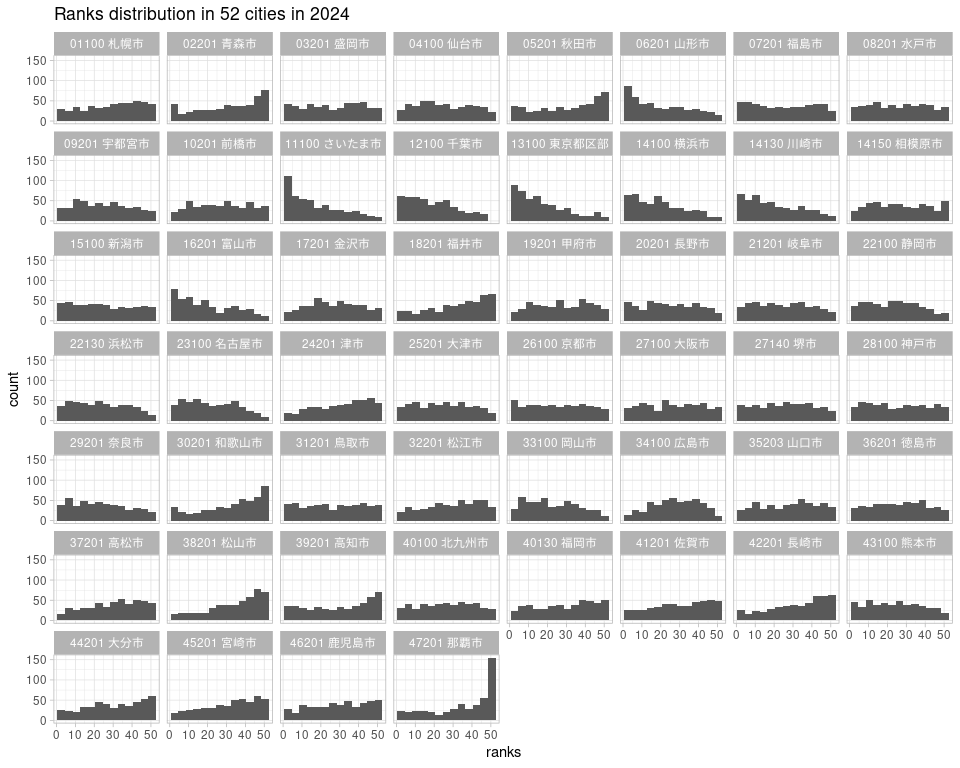

Japan Family Income and Expenditure Survey, city competition
================
Mitsuo Shiota
2019-04-19

  - [Summary](#summary)
  - [Get meta data](#get-meta-data)
  - [Get data](#get-data)
  - [Confirm the Hamamatsu-city’s victory in
    dumplings](#confirm-the-hamamatsu-citys-victory-in-dumplings)
  - [Confirm the Hamamatsu-city’s victory in grilled
    eel](#confirm-the-hamamatsu-citys-victory-in-grilled-eel)
  - [Persistent victory items are mostly speciality
    goods](#persistent-victory-items-are-mostly-speciality-goods)
  - [Who are the top earners in 2018?](#who-are-the-top-earners-in-2018)
  - [Ranks distribution in each city in
    2018](#ranks-distribution-in-each-city-in-2018)

Updated: 2019-05-10

I have made [shinyapps.io](https://mitsuoxv.shinyapps.io/jp-household/),
based on these data.

Warning: If you can’t read Japanese, it would be very difficult for you
to follow me in this project of exploring [e-Stat, Statistics of
Japan](https://www.e-stat.go.jp/en). I tried to refer to English pages,
but often failed to find them. Even in API, when I set the parameter
lang as “E” for English, the response was “statsDataId equal to
\[0003125169\] does not exist”. I had to set lang as “J” for Japanese,
instead.

## Summary

I hear which city in Japan consumed most dumplings (gyouza in Japanese,
and jiaozi in Chinese) per household last year. That is an annual
routine news report. Hamamatsu-city declared victory in February 2019
[(Japanese)](https://prtimes.jp/main/html/rd/p/000000009.000038874.html).

Their claims are based on [Family Income and Expenditure
Survey](https://www.stat.go.jp/english/data/kakei/) by the Statistics
Bureau, Ministry of Internal Affairs and Communications. So I get data
from [e-Stat](https://www.e-stat.go.jp/en) by using [estatapi package by
yutannihilation](https://github.com/yutannihilation/estatapi/blob/master/README.en.md).

I confirm their claim in dumplings, and another claim in grilled eel.

I find that persistent winning items are speciality goods of each city.
I list the top earners in 2018. I draw ranks distribution in each city
in 2018. And I argue ranks distribution is partly due to total
expenditure differences.

## Get meta data

I had to register and get appID, following the instructions in [this
page (Japanese)](https://www.e-stat.go.jp/api/api-info/api-guide). I use
keyring package to use my appID without making it public.

``` r
keyring::key_set("e-stat")
```

I search around in Family Income and Expenditure Survey, and manage to
know the statsDataId of the appropriate table is “0003125169” from [this
page
(Japanese)](https://www.e-stat.go.jp/stat-search/database?page=1&layout=datalist&toukei=00200561&tstat=000000330001&cycle=7&tclass1=000000330001&tclass2=000000330004&statdisp_id=0003125169&result_page=1&second2=1).
As I mentioned in the warning in the top, I failed to set lang = “E”, so
I set “J” instead.

Look at the structure of the response. It is a list of 6 data frames.
estat\_getStatsData function, which I will use later, utilizes @code and
@name in each data frame, and add @name. In this case, I would like to
keep @level in cat01. I make lookup table for cat01, and drop “@” in the
column names. I can check which level I should use, and search
“ぎょうざ”.

``` r
meta_info <- estatapi::estat_getMetaInfo(appId = keyring::key_get("e-stat"),
                               lang = "J",
                               statsDataId = "0003125169")

str(meta_info)
```

    ## List of 6
    ##  $ tab   :Classes 'tbl_df', 'tbl' and 'data.frame':  1 obs. of  3 variables:
    ##   ..$ @code : chr "01"
    ##   ..$ @name : chr "金額"
    ##   ..$ @level: chr ""
    ##  $ cat01 :Classes 'tbl_df', 'tbl' and 'data.frame':  703 obs. of  5 variables:
    ##   ..$ @code      : chr [1:703] "000100000" "000200000" "000300000" "000400000" ...
    ##   ..$ @name      : chr [1:703] "世帯数分布（抽出率調整）" "集計世帯数" "世帯人員" "18歳未満人員" ...
    ##   ..$ @level     : chr [1:703] "1" "1" "1" "2" ...
    ##   ..$ @unit      : chr [1:703] "一万分比" "世帯" "人" "人" ...
    ##   ..$ @parentCode: chr [1:703] NA NA NA "000300000" ...
    ##  $ cat02 :Classes 'tbl_df', 'tbl' and 'data.frame':  4 obs. of  3 variables:
    ##   ..$ @code : chr [1:4] "03" "04" "01" "02"
    ##   ..$ @name : chr [1:4] "二人以上の世帯（2000年～）" "二人以上の世帯のうち勤労者世帯（2000年～）" "二人以上の世帯（農林漁家世帯を除く）（1985年～2007年,2017年）" "二人以上の世帯のうち勤労者世帯（農林漁家世帯を除く）（1985年～2007年,2017年）"
    ##   ..$ @level: chr [1:4] "1" "1" "1" "1"
    ##  $ area  :Classes 'tbl_df', 'tbl' and 'data.frame':  53 obs. of  3 variables:
    ##   ..$ @code : chr [1:53] "00000" "01003" "02003" "03003" ...
    ##   ..$ @name : chr [1:53] "全国" "01100 札幌市" "02201 青森市" "03201 盛岡市" ...
    ##   ..$ @level: chr [1:53] "1" "1" "1" "1" ...
    ##  $ time  :Classes 'tbl_df', 'tbl' and 'data.frame':  34 obs. of  3 variables:
    ##   ..$ @code : chr [1:34] "2018000000" "2017000000" "2016000000" "2015000000" ...
    ##   ..$ @name : chr [1:34] "2018年" "2017年" "2016年" "2015年" ...
    ##   ..$ @level: chr [1:34] "1" "1" "1" "1" ...
    ##  $ .names:Classes 'tbl_df', 'tbl' and 'data.frame':  5 obs. of  2 variables:
    ##   ..$ id  : chr [1:5] "tab" "cat01" "cat02" "area" ...
    ##   ..$ name: chr [1:5] "表章項目" "品目分類（27年改定）" "世帯区分（年次－二人以上の世帯）" "地域区分" ...

``` r
lookup_cat01 <- meta_info$cat01
names(lookup_cat01) <- str_sub(names(lookup_cat01), start = 2L)

lookup_cat01 <- lookup_cat01 %>% 
  rename(cat01_code = code)

lookup_cat01 %>% 
  filter(level == 3)
```

    ## # A tibble: 100 x 5
    ##    cat01_code name                 level unit  parentCode
    ##    <chr>      <chr>                <chr> <chr> <chr>     
    ##  1 000600000  65歳以上無職者人員   3     人    000500000 
    ##  2 010110001  1.1.1 米             3     円    010100000 
    ##  3 010120000  1.1.2 パン           3     円    010100000 
    ##  4 010130000  1.1.3 麺類           3     円    010100000 
    ##  5 010140000  1.1.4 他の穀類       3     円    010100000 
    ##  6 010210000  1.2.1 生鮮魚介       3     円    010200000 
    ##  7 010220000  1.2.2 塩干魚介       3     円    010200000 
    ##  8 010230000  1.2.3 魚肉練製品     3     円    010200000 
    ##  9 010240000  1.2.4 他の魚介加工品 3     円    010200000 
    ## 10 010310000  1.3.1 生鮮肉         3     円    010300000 
    ## # ... with 90 more rows

``` r
lookup_cat01 %>% 
  filter(str_detect(name, "ぎょうざ"))
```

    ## # A tibble: 1 x 5
    ##   cat01_code name         level unit  parentCode
    ##   <chr>      <chr>        <chr> <chr> <chr>     
    ## 1 010920070  371 ぎょうざ 5     円    010920000

## Get data

As the maximum records per GET is set to 100000, I must repeat five
times in this case if I GET manually. Fortunately estat\_getStatsData
function automates this process. I add “level” of cat01, and clean up.

``` r
# get 497447 records
content <- estatapi::estat_getStatsData(
  appId = keyring::key_get("e-stat"),
  lang = "J",
  statsDataId = "0003125169")
```

    ## Fetching record 1-100000... (total: 497447 records)

    ## Fetching record 100001-200000... (total: 497447 records)

    ## Fetching record 200001-300000... (total: 497447 records)

    ## Fetching record 300001-400000... (total: 497447 records)

    ## Fetching record 400001-497447... (total: 497447 records)

``` r
# add level column
temp <- lookup_cat01 %>% 
  select(cat01_code, level)

expenditure <- content %>% 
  left_join(temp, by = "cat01_code") %>% 
  mutate(
    year = str_sub(time_code, start = 1L, end = 4L) %>% as.numeric()
  ) %>% 
  rename(city = 地域区分)
```

## Confirm the Hamamatsu-city’s victory in dumplings

According to [this page
(Japanese)](https://www.stat.go.jp/data/kakei/hyohon.html), the sample
numbers per city are approximately 100 except Tokyo (408 samples). If I
assume the standard deviation is 30 percent of the mean, the standard
error ratio (ratio of standard deviation of mean estimates to the
estimated mean) is 3 percent. Table 1-1 in [this
page](https://www.stat.go.jp/data/kakei/hyohonkekka.html) publish the
standard error ratios in cat01 of level less than 3 in 2013 survey, and
the numbers do not contradict my assumption of 3 percent standard error
ratio for cat01 of level 5.

The second rank Utsunomiya-city consumed 7.4 percent less than top
Hamamatsu-city. Is this difference statistically significant? Imagine
two bell shape curves, left and right. There are overlap area in the
left curve’s right slope and the right curve’s left slope. 1 standard
error from each (total 6 percent) does not overlap, but 2 standard error
(total 12 percent) overlap.

    ## Selecting by value

    ## # A tibble: 10 x 2
    ##    city             value
    ##    <chr>            <dbl>
    ##  1 22130 浜松市      3501
    ##  2 09201 宇都宮市    3241
    ##  3 45201 宮崎市      3106
    ##  4 26100 京都市      2989
    ##  5 27100 大阪市      2586
    ##  6 12100 千葉市      2542
    ##  7 13100 東京都区部  2491
    ##  8 27140 堺市        2379
    ##  9 25201 大津市      2376
    ## 10 46201 鹿児島市    2359

The battle between Hamamatsu-city and Utsunomiya-city is not just in
2018, but has a long history, according to the table in Hamamatsu-city’s
victory declaration
[(Japanese)](https://prtimes.jp/main/html/rd/p/000000009.000038874.html).
Let us confirm it by drawing all available years of top 10 cities in
2018.

<!-- --> The differences
between top 2 and the rest are narrowing.

By the way, these expenditures don’t include dumplings you eat at the
restaurants.

## Confirm the Hamamatsu-city’s victory in grilled eel

Hamamatsu-city’s victory declaration
[(Japanese)](https://prtimes.jp/main/html/rd/p/000000009.000038874.html)
also says that Hamamatsu-city has been the top of eating the grilled eel
in 11 years in a row. Let us confirm it.

I search eel to get cat01\_code. It is “010920010”.

    ## # A tibble: 1 x 5
    ##   cat01_code name                 level unit  parentCode
    ##   <chr>      <chr>                <chr> <chr> <chr>     
    ## 1 010920010  364 うなぎのかば焼き 5     円    010920000

Next, I rank 52 cities every year in 499 items of level 5. 52 cities
consist of 47 prefectural capital cities and 5 non-prefectural-capital
large cities whose population is more than half million.

I show the top 3 in eel every year, and confirm Hamamatsu-city’s claim
again.

    ##       [,1]           [,2]             [,3]              
    ## ranks "1"            "2"              "3"               
    ## 2007  "21201 岐阜市" "23100 名古屋市" "26100 京都市"    
    ## 2008  "22130 浜松市" "32201 松江市"   "29201 奈良市"    
    ## 2009  "22130 浜松市" "26100 京都市"   "22100 静岡市"    
    ## 2010  "22130 浜松市" "26100 京都市"   "24201 津市"      
    ## 2011  "22130 浜松市" "26100 京都市"   "29201 奈良市"    
    ## 2012  "22130 浜松市" "30201 和歌山市" "27100 大阪市"    
    ## 2013  "22130 浜松市" "26100 京都市"   "14130 川崎市"    
    ## 2014  "22130 浜松市" "26100 京都市"   "23100 名古屋市"  
    ## 2015  "22130 浜松市" "17201 金沢市"   "13100 東京都区部"
    ## 2016  "22130 浜松市" "25201 大津市"   "23100 名古屋市"  
    ## 2017  "22130 浜松市" "26100 京都市"   "25201 大津市"    
    ## 2018  "22130 浜松市" "26100 京都市"   "17201 金沢市"

As Hamamatsu-city joined non-prefectural-capital large cities in April
2007, their numbers began to show up from 2008.

## Persistent victory items are mostly speciality goods

Are there similar items whose consumption are dominated persistently by
one city? I count the number of cities which get the top rank in 11
years from 2007 to 2018 for each item.

<!-- -->

There are 24 items where one city keeps the top rank. Most of these
items match speciality goods in each city.

    ## # A tibble: 24 x 3
    ##    cat01_code `品目分類（27年改定）` city            
    ##    <chr>      <chr>                  <chr>           
    ##  1 010130010  130 生うどん・そば     37201 高松市    
    ##  2 010211010  170 まぐろ             22100 静岡市    
    ##  3 010211040  174 かつお             39201 高知市    
    ##  4 010211100  181 ぶり               16201 富山市    
    ##  5 010212020  192 しじみ             32201 松江市    
    ##  6 010212030  191 かき(貝)           34100 広島市    
    ##  7 010212040  194 ほたて貝           02201 青森市    
    ##  8 010230010  203 揚げかまぼこ       46201 鹿児島市  
    ##  9 010230020  204 ちくわ             31201 鳥取市    
    ## 10 010230030  205 かまぼこ           04100 仙台市    
    ## 11 010240010  210 かつお節・削り節   47201 那覇市    
    ## 12 010240040  216 魚介の缶詰         47201 那覇市    
    ## 13 010320040  229 他の加工肉         47201 那覇市    
    ## 14 010512010  250 さつまいも         36201 徳島市    
    ## 15 010512050  254 にんじん           47201 那覇市    
    ## 16 010513010  260 さやまめ           15100 新潟市    
    ## 17 010530020  281 油揚げ・がんもどき 18201 福井市    
    ## 18 010540010  290 こんにゃく         06201 山形市    
    ## 19 010610060  305 梨                 31201 鳥取市    
    ## 20 010610150  313 他の果物           06201 山形市    
    ## 21 010800030  342 他の和生菓子       17201 金沢市    
    ## 22 010800040  343 カステラ           42201 長崎市    
    ## 23 011211010  390 日本そば・うどん   37201 高松市    
    ## 24 011211100  396 他の主食的外食     13100 東京都区部

## Who are the top earners in 2018?

In how many items among 499 did each city get the top in 2018?

    ## # A tibble: 52 x 2
    ## # Groups:   city [52]
    ##    city                 n
    ##    <chr>            <int>
    ##  1 12100 千葉市        19
    ##  2 17201 金沢市        19
    ##  3 31201 鳥取市        19
    ##  4 11100 さいたま市    18
    ##  5 40130 福岡市        16
    ##  6 21201 岐阜市        15
    ##  7 26100 京都市        15
    ##  8 37201 高松市        15
    ##  9 39201 高知市        15
    ## 10 16201 富山市        14
    ## 11 18201 福井市        14
    ## 12 29201 奈良市        14
    ## 13 32201 松江市        14
    ## 14 14130 川崎市        13
    ## 15 24201 津市          12
    ## 16 06201 山形市        11
    ## 17 20201 長野市        11
    ## 18 23100 名古屋市      11
    ## 19 47201 那覇市        11
    ## 20 03201 盛岡市        10
    ## 21 13100 東京都区部    10
    ## 22 22100 静岡市        10
    ## 23 22130 浜松市        10
    ## 24 35203 山口市        10
    ## 25 02201 青森市         9
    ## 26 08201 水戸市         9
    ## 27 09201 宇都宮市       9
    ## 28 01100 札幌市         8
    ## 29 14150 相模原市       8
    ## 30 33100 岡山市         8
    ## 31 04100 仙台市         7
    ## 32 05201 秋田市         7
    ## 33 15100 新潟市         7
    ## 34 25201 大津市         7
    ## 35 38201 松山市         7
    ## 36 44201 大分市         7
    ## 37 10201 前橋市         6
    ## 38 14100 横浜市         6
    ## 39 27100 大阪市         6
    ## 40 27140 堺市           6
    ## 41 28100 神戸市         6
    ## 42 34100 広島市         6
    ## 43 40100 北九州市       6
    ## 44 46201 鹿児島市       6
    ## 45 07201 福島市         5
    ## 46 36201 徳島市         5
    ## 47 41201 佐賀市         5
    ## 48 42201 長崎市         5
    ## 49 19201 甲府市         4
    ## 50 30201 和歌山市       3
    ## 51 43100 熊本市         2
    ## 52 45201 宮崎市         2

## Ranks distribution in each city in 2018

I draw the histogram that shows each city’s ranks of 499 items in 2018.
Naha-city and other Kyushu cities and Wakayama-city tend to rank low,
while Tokyo and other Kanto cities tend to rank high.

<!-- --> This pattern
reflects that total expenditures are high in Kanto, and low in
Wakayama-city, Naha-city and other Kyushu cities, partly due to price
level differences.

<!-- -->

    ## Parsed with column specification:
    ## cols(
    ##   city = col_character(),
    ##   city_e = col_character()
    ## )

EOL
